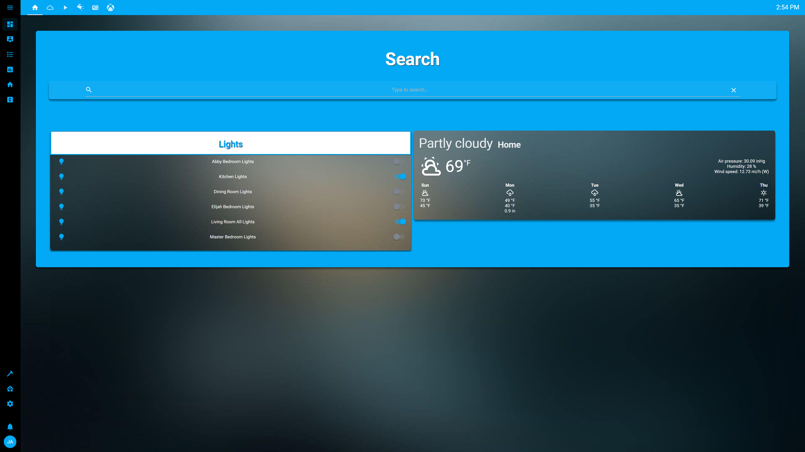
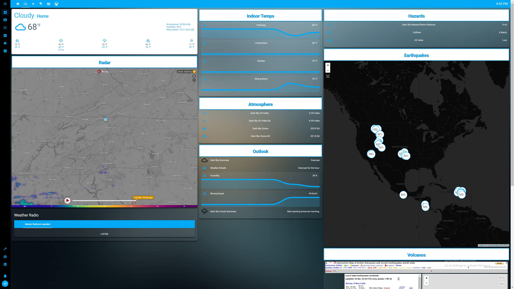
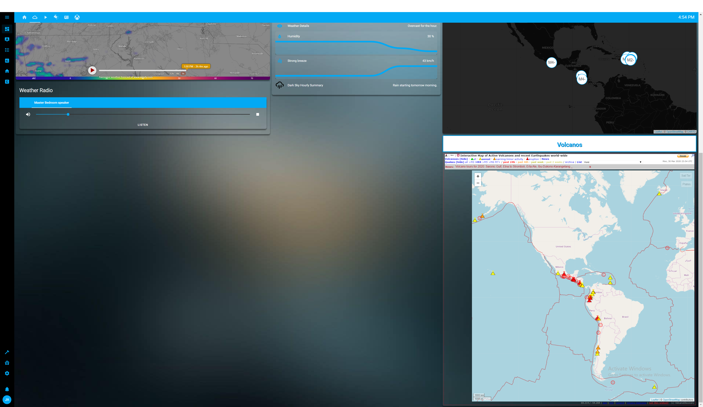
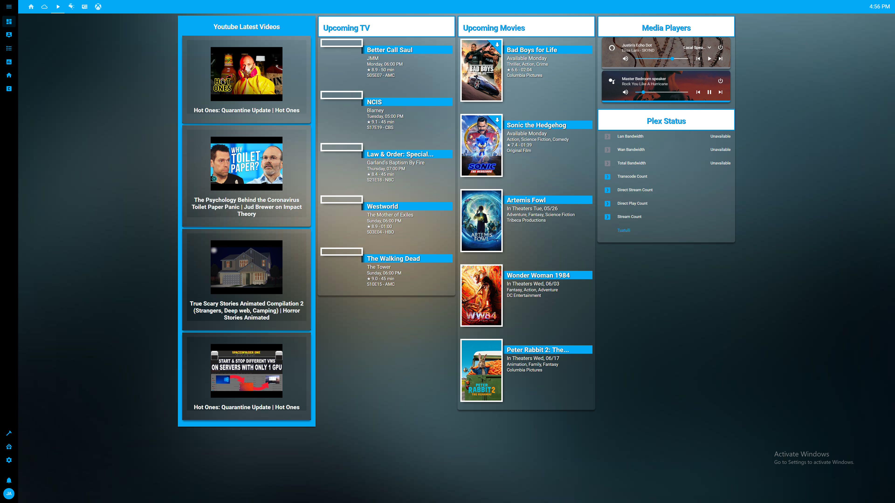
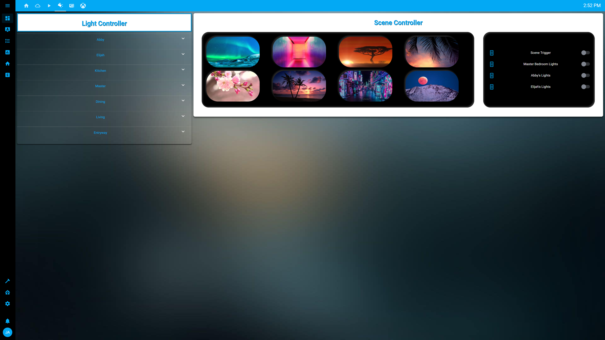
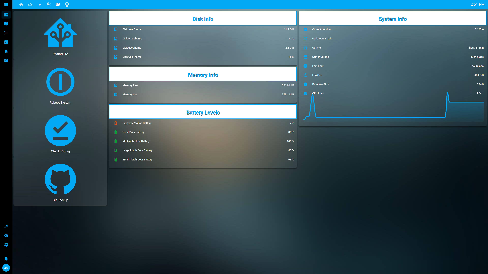
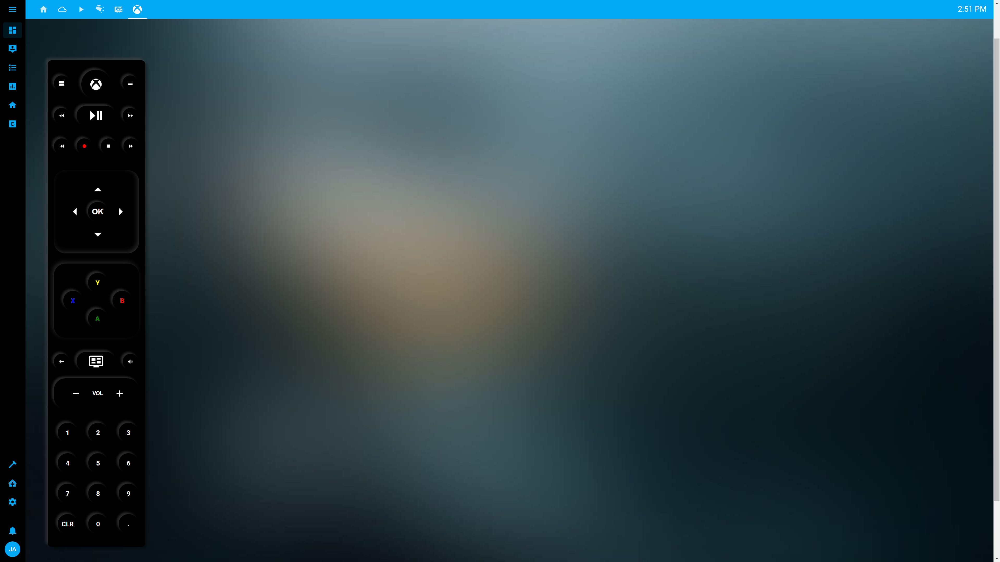

Hassio config
=============

Currently Working On
====================

-	[x] Themes/Theme-Backgrounds
-	[ ] Entryway Camera Not Showing
-	[ ] Scene Toggling/Reset Trigger
-	[ ] Sending Scene to different rooms
-	[ ] ADB/FireStick Tv implication

Features
========

| Card                                    | View Used In  | Link                                                                                |
|-----------------------------------------|---------------|-------------------------------------------------------------------------------------|
| Battery Entity Card                     | System View   | https://github.com/cbulock/lovelace-battery-entity                                  |
| button-card                             | Throughout    | https://github.com/custom-cards/button-card                                         |
| card-mod                                | Throughout    | https://github.com/thomasloven/lovelace-card-mod                                    |
| card-tools version 0.4                  | System View   | https://github.com/thomasloven/lovelace-card-tools                                  |
| Config Check                            | System        | https://github.com/custom-components/config_check                                   |
| Custom Header                           | Throughout    | https://github.com/maykar/custom-header                                             |
| fold-entity-row                         | Lighting View | https://github.com/thomasloven/lovelace-fold-entity-row                             |
| FontAwesome                             | Xbox Remote   | https://github.com/thomasloven/hass-fontawesome                                     |
| HACS (Home Assistant Community Store)   | System        | https://github.com/hacs/integration                                                 |
| hass-favicon                            | Throughout    | https://github.com/thomasloven/hass-favicon                                         |
| HTML Jinja2 Template card               | Youtube Card  | https://github.com/PiotrMachowski/Home-Assistant-Lovelace-HTML-Jinja2-Template-card |
| Hue sensor advanced                     | Lighting      | https://github.com/robmarkcole/Hue-sensors-HASS                                     |
| layout-card                             | System View   | https://github.com/thomasloven/lovelace-layout-card                                 |
| Light Entity Card                       | Lighting View | https://github.com/ljmerza/light-entity-card                                        |
| Media Player Jukebox for Home-Assistant | Weather/Media | https://github.com/lukx/home-assistant-jukebox                                      |
| Mini Graph card                         | System View   | https://github.com/kalkih/mini-graph-card                                           |
| Mini Media Player                       | Media View    | https://github.com/kalkih/mini-media-player                                         |
| Search Card                             | Home View     | https://github.com/postlund/search-card                                             |
| Upcoming Media                          | Media View    | https://github.com/custom-cards/upcoming-media-card                                 |
| Vertical Stack In Card                  | Throughout    | https://github.com/custom-cards/vertical-stack-in-card                              |
| Weatheralerts                           | Weather/Popup | https://github.com/custom-components/weatheralerts                                  |
| Youtube Sensor                          | Media View    | https://github.com/custom-components/youtube                                        |

| Nonuse Card | Reason  | Link                                            |
|-------------|---------|-------------------------------------------------|
| browser_mod | Testing | https://github.com/thomasloven/hass-browser_mod |
| Feedparser  | Testing | https://github.com/custom-components/feedparser |

| Replaced Card         | Reason        | Link                                                                        |
|-----------------------|---------------|-----------------------------------------------------------------------------|
| Compact Custom Header | Replaced      | https://github.com/maykar/custom-lovelace/tree/master/compact-custom-header |
| Weather Card          | Using Default | https://github.com/bramkragten/custom-ui/tree/master/weather-card           |

Equipment
=========

| Hardware                                                               | Qty | Model              | Webpage                                                                                               |
|------------------------------------------------------------------------|-----|--------------------|-------------------------------------------------------------------------------------------------------|
| Raspberry Pi 3B+ (Hassio/Kodi)                                         | 3   | Broadcom BCM2837B0 | https://www.raspberrypi.org/products/raspberry-pi-3-model-b-plus/                                     |
| Google - Home Mini                                                     | 2   | GA00210-US         | https://store.google.com/us/product/google_home_mini                                                  |
| Amazon - Echo Dot 3rd Gen                                              | 1   | B07PDHSLM6         | https://www.amazon.com/Echo-Dot/dp/B07FZ8S74R                                                         |
| Smartthings Hub                                                        | 1   | GP-U999SJVLGDB     | https://www.samsung.com/us/smart-home/smartthings/hubs/samsung-smartthings-hub--2018--gp-u999sjvlgda/ |
| Philips - Hue Bridge 2nd Generation                                    | 1   | 458471             | https://www2.meethue.com/en-us/p/hue-bridge/046677458478                                              |
| Sengled - Smart Hub (Not Used Connected ST Hub)                        | 1   | NA-HUB2WA          | https://us.sengled.com/products/sengled-smart-hub                                                     |
| Insignia™ - 32" Class - (31.5" Diag.) - LED - 720p - HDTV              | 2   | NS-32D311NA17      | https://www.insigniaproducts.com/pdp/NS-32D311NA17/5326401                                            |
| VIZIO SmartCast™ - M-Series™ 55" Class Ultra HD HDR XLED Plus™ Display | 1   | M55-E0             | https://www.vizio.com/m55e0.html                                                                      |

| Sensors                         | Qty | Model          | Webpage                                                                                                                |
|---------------------------------|-----|----------------|------------------------------------------------------------------------------------------------------------------------|
| SmartThings Multipurpose Sensor | 4   | GP-U999SJVLAAA | https://www.samsung.com/us/smart-home/smartthings/sensors/samsung-smartthings-multipurpose-sensor-2018-gp-u999sjvlaaa/ |
| SmartThings Motion Sensor       | 5   | GP-U999SJVLBAA | https://www.samsung.com/us/smart-home/smartthings/sensors/samsung-smartthings-motion-sensor-2018-gp-u999sjvlbaa/       |
| SmartThings Button              | 2   | GP-U999SJVLEAA | https://www.samsung.com/us/smart-home/smartthings/buttons/samsung-smartthings-button-gp-u999sjvleaa/                   |

| Lights                                                                         | Qty | Model    | Webpage                                                                               |
|--------------------------------------------------------------------------------|-----|----------|---------------------------------------------------------------------------------------|
| Philips - Hue White & Color Ambiance A19 Bluetooth Smart LED Bulb - Multicolor | 4   | 548487   | https://www2.meethue.com/en-us/p/hue-white-and-color-ambiance-1-pack-e26/046677548483 |
| Sengled - Smart LED Multicolor Light Strip - Multicolor                        | 3   | E1G-G8EW | https://us.sengled.com/products/sengled-smart-led-multicolor-light-strip              |
| Sengled Smart LED Multicolor A19 Bulb                                          | 6   | W11-N13W | https://us.sengled.com/products/sengled-smart-led-multicolor-a19-bulb                 |

| Switches                                | Qty | Model | Webpage                                                                                  |
|-----------------------------------------|-----|-------|------------------------------------------------------------------------------------------|
| TP-Link - Kasa Smart Wi-Fi Light Switch | 4   | HS200 | https://www.kasasmart.com/us/products/smart-switches/kasa-smart-wi-fi-light-switch-hs200 |

| Plugins                              | Qty | Model | Webpage                                                                     |
|--------------------------------------|-----|-------|-----------------------------------------------------------------------------|
| TP-Link - Kasa Smart Wi-Fi Plug Mini | 4   | HS105 | https://www.kasasmart.com/us/products/smart-plugs/kasa-smart-wifi-plug-mini |

| Remote                          | Qty | Model      | Webpage                                                         |
|---------------------------------|-----|------------|-----------------------------------------------------------------|
| Harmony Hub                     | 1   | 915-000238 | https://www.logitech.com/en-us/product/harmony-hub              |
| Philips Hue Smart Dimmer Switch | 2   | 458141     | https://www2.meethue.com/en-us/p/hue-dimmer-switch/046677473372 |

Future
======

| Feature                           | Link                                                  |
|-----------------------------------|-------------------------------------------------------|
| Text Divider Row                  | https://github.com/custom-cards/text-divider-row      |
| Raspberry Pi Power Supply Checker | https://github.com/custom-components/sensor.rpi_power |

Implement
=========

-	[ ] Alexa custom responses/automation/skills
-	[ ] Google_assistant setup/look into
-	[ ] Googlehome setup bluetooth detection
-	[ ] Git backup button
-	[ ] Auto git backup
-	[ ] Backgrounds for each theme

Screen Shots
============

Home View
---------

Weather View
------------

 

Media View
----------

Light View
----------

System View
-----------

Custom Harmony Xbox Remote
--------------------------

Fix
===

-	[ ] Floorplan image background
-	[ ] Add new device to floorplan

Fixed
=====

-	[x] Clean up config folder for git backup
-	[x] Add youtube media cards
-	[x] Colors of System Buttons
-	[x] Viziocast to tv and audiobar
-	[x] Convert cch to Compact Header
-	[x] Fix light control layout
-	[x] Tautulli install fix media card
-	[x] Database Recorder
